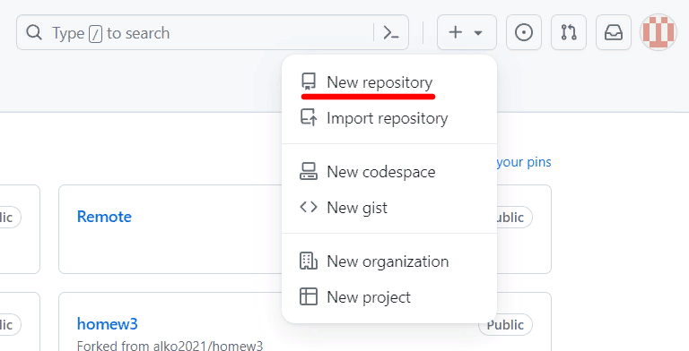

# Инструкция для работы с Git и удалёнными репозиториями
## Что такое Git?
__Git__ - это бесплатная распределенная система контроля версий с открытым исходным кодом, которая отвечает за все, что связано с GitHub и происходит локально на вашем компьютере.

# Команды

* git init - Инициализация: указываем папку, в которой git начнёт отслеживать изменения В папке создаётся скрытая папка .git. 

* git status - Показывает текущее состояние гита, есть ли изменения, которые нужно закоммитить (сохранить).

* git add - добавляет содержимое рабочего каталога в индекс (staging area) для последующего коммита. Эта команда дается после добавления файлов. Писать название целиком не обязательно: терминал дозаполнит данные автоматически.

* git commit - зафиксировать или сохранить. По умолчанию git commit использует лишь этот индекс, так что вы можете использовать git add для сборки слепка вашего следующего коммита.

*Команда git commit берёт все данные, добавленные в индекс с помощью git add, и сохраняет их слепок во внутренней базе данных, а затем сдвигает указатель текущей ветки на этот слепок.*

git add > git commit *, т.е. сначала сохранение, потом комментирование*

* git log - Журнал изменений. Перед переключением версии файла в Git используйте команду git log, чтобы увидеть количество сохранений.

* git branch - создаёт несколько версий черновика. Их мы можем вывести на экран ветку, где находимся, командой git branch.

Создать ветку можно командой git branch. Делать это надо в папке с репозиторием: git branch <название новой ветки>.

*Ветки позволяют легко управлять черновиками и чистовиками в Git.*

* git branch text_form
* - ветка, с которой работают
master(main) - основная/главная ветка

* git chekout - Переключение между версиями. Для работы нужно указать не только интересующий вас коммит, но и вернуться в тот, где работаем, при помощи команды git checkout master.

*Нажатие клавиши ‘q’ возвращает в исходное окно терминала*

Если потребуется переключиться с одной ветки на другую, вызовем команду git checkout <имя ветки>

git chekout text_form

* git diff - Показывает разницу между текущим файлом и сохранённы. Перед переключением версии файла в Git используйте команду git log, чтобы увидеть количество сохранений.

*Git отслеживает файлы по имени! Если изменить имя файла, необходимо добавить файл с новый именем + git commit*

* git merge - совмещение двух вариантов текста.
Чтобы слить любую ветку с текущей, вызываем git merge <имя ветки для слияния>.

* git branch -d - команда для удаления веток.

-d -удаление
git branch -d <имя ветки для удаления>

* git log --graph - визуализация всех веток

*Имена файлов обязательно указываем с расширениями и не «теряем» пробелы.*
*Помним, что Git управляет сохраненными файлами, а не теми, что в процессе редактирования.*

## Подготовка репозитория
Для создание репозитория необходимо выполнить команду git init в папке с репозиторием и у Вас создаться репозиторий (появится скрытая папка .git)

~~Создание коммитов~~

***Git add***
Для добавления измений в коммит используется команда *git add*. Чтобы использовать команду git add напишите git add <имя файла>

## Просмотр состояния репозитория

Для того, чтобы посмотреть состояние репозитория используется команда git status. Для этого необходимо в папке с репозиторием написать git status, и Вы увидите были ли измения в файлах, или их не было.

## Создание коммитов

Для того, чтобы создать коммит(сохранение) необходимо выполнить команду git commit. Выполняется она так: git commit -m "<сообщение к коммиту>. Все файлы для коммита должны быть ДОБАВЛЕНЫ и сообщение к коммиту писать ОБЯЗАТЕЛЬНО.

## **Перемещение между сохранениями**

Для того, чтобы перемещаться между коммитами, используется команда git checkout. Используется она в папке с пепозиторием следующим образом: git checkout <номер коммита>

## *Журнал изменений*

Для того, чтобы посмтреть все сделанные изменения в репозитории, используется команда git log. Для этого достаточно выполнить команду git log в папке с репозиторием

# **Ветки в Git**

### 1 *Создание ветки*

Для того, чтобы создать ветку, используется команда *git branch.* Делается это следующим образом в папке с репозиторием: *git branch* **<название новой ветки>**

### 2 *Слияние веток*

Для того чтобы дабавить ветку в текущую ветку используется команда *git merge*

### 3 *Удаление веток*

Для удаления ветки ввести команду ~~gitbrunch~~ "git branch -d 'name branch'"

## Работа с изображениями

Чтобы вставить изображение в текст, достаточно написать следующее:
![*Ссылка рисунка*], потом (*Название файла с рисунком*.jpg)

**Например:**

## Работа с текстом

### Выделение текста

- Заголовок – выделение заголовков. Количество символов “#” задаёт уровень заголовка
(поддерживается 6 уровней).
- = или - – подчёркиванием этими символами (не менее 3 подряд) выделяют заголовки первого
(“=”) и второго (“-”) уровней.
- ** Полужирное начертание** или __ Полужирное начертание__
- *Курсивное начертание* или _Курсивное начертание_
- ***Полужирное курсивное начертание***
- ~~Зачёркнутый текст~~
- * Строка – ненумерованные списки, символ “*” в начале строки
- 1, 2, 3 … – нумерованные списки

### Списки 

Чтобы добавить ненумерованные списки, необходимо пункты выделить звёздочкой(*) или знаком +.
Например, вот так:
* Элемент 1
* Элемент 2
* Элемент 3
+ Элемент 4

Чтобы добавить нумеровваные списки, необходимо пункты пронумеровать.
Например, вот так:
1. Первый пункт
2. Второй пункт

## Работа с удаленными репозиториями

### Выгрузки локального репозитория в удаленный репозиторий (Push)

1. Создать аккаунт на Github.
2. Создать локальный репозиторий 
3. Создать удалённый репозиторий 

4. Связать локальный репозиторий с удалённым, через команду git remote
5. Получить изменения из удалённого репозитория и выполнить слияние с локальной версией
6. Отправить локальную версию репозитория на внешний `git push`, т.е.

git remote add origin https://github.com/Geats52/-Git.git

7. Получить список связанных репозиториев `git remote` 

### Загрузка из удаленного репозитория в локальный репозиторий(pull request)

1. В своём аккаунте на GitHub создать копию репозитория.

*Например:* "AndreyBulgakov19/SCV_GitPR" с помощью кнопки "Fork".

2. Клонировать копию репозитория на локальный компьютер.
3. Создать новую ветку.
4. Добавить файл с инструкцией в новую ветку.
5. Дополнить инструкцию разделами по работе с удалёнными репозиториями, pull request.
6. Зафиксировать изменения (коммиты).
7. Отправить изменения на GitHub.
8. На сайте GitHub выполнить Pull request.